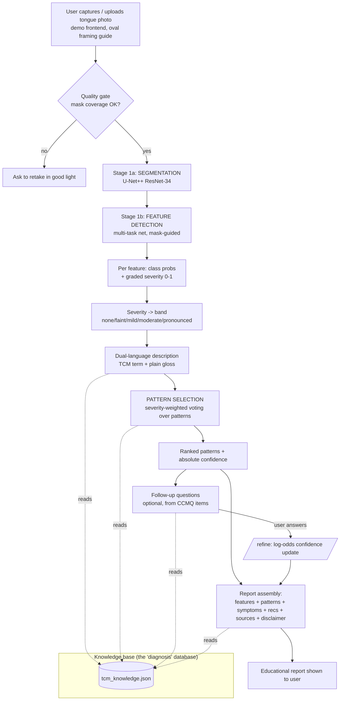

# User Workflow — from photo to report (and where every "diagnosis" comes from)

This traces one analysis end-to-end and, at each step, names **which model or database** produces the
output. Educational framing: patterns are "traditionally associated with…", never a medical diagnosis.

## The flow at a glance

## Step-by-step, with provenance

| # | Step | What happens | Produced by / sourced from |
|---|---|---|---|
| 1 | **Capture** | User photographs the tongue inside an on-screen oval guide; image sent to `/analyze`. | `deployment/api/static/index.html` + `app.py` |
| 2 | **Quality gate** | Reject if the detected tongue is too small/large (bad framing/lighting). | `service.framing_feedback` + `infer.py` coverage check |
| 3 | **Segmentation** | Predict a pixel mask of the tongue → isolates it from lips/face. | **U-Net++ (ResNet-34)** `checkpoints/seg_combined`, trained on **TonguExpert (5,992)** + **SM-Tongue (2,155 real photos)**. Real-photo Dice ≈ 0.975 |
| 4 | **Feature detection** | From the masked tongue, predict the 5 characteristics: coating thickness, coating color, body color, fissures, tooth-marks. | **MultiTaskTongueNet** `checkpoints/multitask_v3` (shared encoder + mask-guided pooling). Classes trained on **TonguExpert labels** (L2 predicted + L1 practitioner-verified gold) |
| 5 | **Severity (degree)** | Each feature also gets a **0–1 severity** — the "how much" that fixes generic output. Blend of (a) expected-ordinal value from class probabilities and (b) a **regression head** trained on TonguExpert's continuous phenotype **measurements** (crack area, tooth-mark area, coating coverage). | `infer.py` (probs + severity), regression head trained on `data/build_severity.py` targets |
| 6 | **Bands** | Severity → words: `none / faint / mild / moderate / pronounced`. | `tcm_knowledge.json → severity_bands` |
| 7 | **Dual-language description** | For each detected feature, produce the **TCM term** and a **plain-language gloss** (e.g. dampness → "sluggish digestion, bloating"). | `tcm_knowledge.json → features.<char>`; glosses grounded in **Maciocia/Kirschbaum** + **SymMap** (TCM→plain symptom mapping) |
| 8 | **Pattern selection ("the diagnoses")** | Every feature `points_to` one or more **patterns** with weights; contributions are **weighted by severity** and summed; patterns are ranked. | `interpret.vote_patterns`; pattern set = **CCMQ 9 constitutions**, names from **WHO ICD-11 Ch.26** — all in `tcm_knowledge.json → patterns` |
| 9 | **Confidence** | Raw vote score → **absolute** (saturating) confidence, so weak signals read low and a normal tongue leads with "Balanced". | `interpret.vote_patterns` |
| 10 | **Follow-up (optional)** | For the top pattern, ask 1–3 plain-language questions (**validated CCMQ items**, e.g. "Do you feel bloated after eating?"). | `tcm_knowledge.json → patterns.*.followup_questions` |
| 11 | **Refine** | Each Yes/No updates confidence via a transparent **log-odds** step (item weight = published CCMQ weight). | `interpret.refine` + `/refine` endpoint |
| 12 | **Report** | Assemble: per-feature (dual language), combined synthesis, plain-language associated symptoms, **specific** recommendations, grounding sources, disclaimer. Optional LLM only *rephrases* this grounded content (RAG). | `interpret.interpret` (+ optional `llm_client`) |

## So: "from what database are the diagnoses selected, and how identified?"

- **The database is a single, editable file: [`stage2_interpretation/knowledge_base/tcm_knowledge.json`](../../stage2_interpretation/knowledge_base/tcm_knowledge.json).** It holds (a) per-feature meanings and (b) the pattern catalogue with their tongue-sign triggers, plain-language symptoms, follow-up questions, and recommendations.
- **How a pattern is identified:** it is *not* a black-box classifier output. The image model only detects **features + severities**. Those features vote — weighted by how strong each is — toward patterns via the `points_to` weights in the KB. The highest-scoring pattern(s) are surfaced, with an honest absolute confidence, and can be refined by the follow-up questions. This keeps the reasoning **transparent and auditable** (you can see exactly which feature drove which pattern) and **improvable** (edit the JSON).
- **Provenance of the pattern catalogue:** pattern **names** follow **WHO ICD-11 Chapter 26** (196 standardized TM patterns); the pattern **set + questions** follow the **CCMQ** (Wang Qi, Beijing University of Chinese Medicine — a validated 9-constitution instrument used in Chinese national health surveys); feature **interpretations** follow **Maciocia / Kirschbaum**; **plain-language** symptom glosses draw on **SymMap** (peer-reviewed TCM↔modern-symptom mapping). Full detail in [03_KNOWLEDGE_SOURCES.md](03_KNOWLEDGE_SOURCES.md).

## How to improve it (the point of this folder)
- **Add/adjust a pattern or its recommendations:** edit `tcm_knowledge.json → patterns`. No retraining needed.
- **Change how strongly a feature implies a pattern:** edit the `points_to` weights in `features`.
- **Tune sensitivity wording:** edit `severity_bands`.
- **Add follow-up questions:** add to a pattern's `followup_questions` (keep them from validated instruments).
- **Detect *new* features** (purple body, red dots, peeled coating…): needs new training data → see [04_DATA_MODELS_RESEARCH.md](04_DATA_MODELS_RESEARCH.md) (Phase 4).
